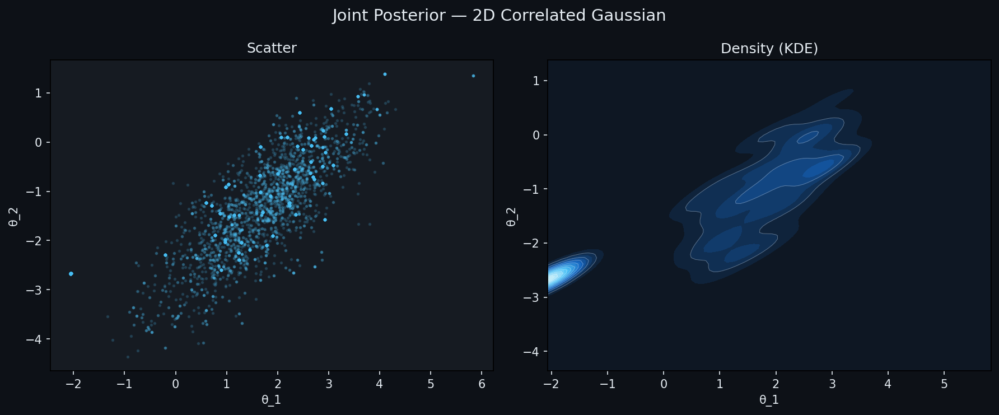

# Markov Chain MCMC Simulator

A full-featured Markov Chain Monte Carlo (MCMC) simulator implementing the Metropolis-Hastings algorithm for sampling from arbitrary probability distributions. This is a research-grade implementation with built-in diagnostics, adaptive sampling, and support for diverse target distributions.

## What It Does

The simulator performs Bayesian inference by drawing samples from complex probability distributions using the Metropolis-Hastings algorithm. It handles distributions where analytical solutions are intractable, making it essential for modern statistical inference. The implementation includes automatic step-size adaptation, multiple chain convergence diagnostics, and effective sample size estimation.

## Core Components

### 1. Metropolis-Hastings Sampler (sampler.py)

The heart of the system. Implements a general-purpose random-walk Metropolis-Hastings sampler that works with any log-probability function.

Key features:
- Parallel multi-chain execution for convergence diagnostics
- Automatic step-size adaptation during warmup phase (dual averaging)
- Support for Gaussian and uniform proposal distributions
- Configurable burn-in periods and chain initialization
- Efficient autocorrelation computation via FFT

Algorithm overview:
1. Start at initial position x₀
2. Propose new position x* using random walk: x* = x + ε·N(0,1)
3. Compute acceptance ratio: α = min(1, p(x*)/p(x))
4. Accept with probability α, otherwise keep current x
5. Repeat for n_samples iterations across multiple chains
6. Adapt step size during warmup to achieve ~23.4% acceptance rate

### 2. Target Distributions (distributions.py)

A library of benchmark and real-world distributions to test the sampler:

**Simple Cases:**
- **2D Correlated Gaussian**: Hello world of MCMC. Simple but has analytic solution for verification.

**Challenging Benchmarks:**
- **Banana (Rosenbrock)**: Curved posterior that tests mixing. x₁ and x₂ are nonlinearly correlated.
- **Donut/Ring**: Probability mass on a thin ring. Tests global exploration — chains can get stuck.
- **3-Mode Gaussian Mixture**: Multimodal distribution. Different chains may find different modes → high R-hat.
- **Neal's Funnel**: Pathological case from hierarchical Bayesian models. Variance depends exponentially on one parameter.

**Real Applications:**
- **Bayesian Linear Regression**: Actual inference problem where you observe data and estimate coefficients.

### 3. Diagnostics and Visualization (plots.py)

Research-grade convergence diagnostics matching Stan/PyMC standards:

**R-hat (Gelman-Rubin Statistic)**
- Compares between-chain vs within-chain variance
- R-hat ≈ 1.00 → converged ✓
- R-hat > 1.01 → run longer
- R-hat > 1.10 → definitely not converged
- Uses rank-normalized split R-hat (Vehtari 2021)

**Effective Sample Size (ESS)**
- Accounts for autocorrelation in samples
- Independent samples matter, not total count
- Computed via Geyer's initial positive sequence
- ESS << n_samples indicates high autocorrelation

**Visual Diagnostics:**
- Trace plots: Should look like a "hairy caterpillar" (white noise)
- Posterior histograms: Marginal distribution of each parameter
- Autocorrelation function: How quickly correlation decays with lag
- Running mean: Convergence to true posterior mean

### 4. Experiment Runner (run.py)

Execute five canonical experiments with one command:

```bash
python Markov-chains/run.py --target all
```

Runs:
1. **2D Gaussian** - Baseline convergence check
2. **Banana** - Tests handling of curved posteriors
3. **Donut** - Tests global exploration
4. **Mixture** - Tests multimodal distributions
5. **Bayesian Regression** - Real inference problem

## How MCMC Works

### The Problem
You have a complex probability distribution p(x) but cannot sample directly. Examples:
- Bayesian posterior p(θ | data)
- Likelihood functions in machine learning
- Unnormalized distributions

### The Solution
Metropolis-Hastings constructs a Markov chain that has p(x) as its stationary distribution. After enough iterations (burn-in), samples from the chain approximate samples from p(x).

### Why It Matters
- Works with any p(x) — no shape restrictions
- Scales to high dimensions (unlike grid methods)
- Provides uncertainty quantification automatically
- Foundation of Bayesian inference

## Installation

```bash
pip install numpy scipy matplotlib
python Markov-chains/run.py --target gaussian
```

## Usage Examples

### Basic Usage
```python
import numpy as np
from sampler import MetropolisHastings
from distributions import gaussian_2d

# Define target distribution
target = gaussian_2d()

# Create sampler
sampler = MetropolisHastings(
    log_prob=target,
    n_dims=2,
    step_size=0.5,
    adapt_step_size=True,
    seed=42
)

# Run sampling
result = sampler.run(n_samples=5000, n_chains=4)

# Access samples
print(f"Acceptance rate: {result.acceptance_rate}")
print(f"Effective sample size: {result.effective_sample_size}")
```

### Visualize Results
```python
from plots import plot_diagnostics, plot_joint, r_hat

# Full diagnostic dashboard
plot_diagnostics(result, target_name="My Distribution",
                 save_path="diagnostics.png")

# Joint posterior scatter + density
plot_joint(result, save_path="joint.png")

# Convergence metric
rhat = r_hat(result)
print(f"R-hat: {rhat}  (< 1.01 = converged)")
```

## Results




## Key Concepts

**Burn-in**: First 50% of samples discarded to let chain reach stationary distribution.

**Effective Sample Size (ESS)**: If samples are autocorrelated, you have fewer independent samples than total count. ESS corrects for this.

**Acceptance Rate**: Percentage of proposed moves accepted. Target is ~23.4% for Gaussian proposals in high dimensions (Roberts et al. 1997).

**Step Size Adaptation**: Automatically tunes proposal variance during warmup to achieve target acceptance rate.

**Multiple Chains**: Running 4 chains from dispersed starting points allows detection of convergence failures.

## Advanced Features

- Rank-normalized R-hat for robustness to non-normal posteriors
- Geyer's initial positive sequence ESS estimation
- FFT-based autocorrelation computation for speed
- Robbins-Monro step-size adaptation
- Dark mode visualization for publication-ready plots

## What Makes This Implementation Production-Grade

1. **Convergence Diagnostics**: R-hat and ESS computed correctly per literature
2. **Adaptive Sampling**: Step size tuned automatically to optimal acceptance rate
3. **Research Standard**: Matches Stan, PyMC, and standard MCMC textbooks
4. **Error Handling**: Validates all distributions return finite log-probabilities
5. **Visualization**: Publication-quality plots with dark theme
6. **Real-World Example**: Includes Bayesian regression as proof of utility

## When to Use This

- Learning MCMC algorithms and theory
- Prototyping Bayesian inference workflows
- Benchmarking difficult-to-sample distributions
- Understanding sampler behavior with diagnostic plots
- Implementing custom Bayesian models with Gaussian proposals

## Limitations

- Random-walk proposal: Not efficient for high-dimensional posteriors (use HMC instead)
- Multimodal distributions: May miss modes if chains get stuck
- No parallel tempering: For truly multimodal distributions, consider advanced methods

## References

- Gelman et al. (1995) "Inference from Iterative Simulation Using Multiple Sequences"
- Roberts et al. (1997) "Weak Convergence and Optimal Scaling"
- Vehtari et al. (2021) "Rank-normalization, folding, and localization"
- Neal (2003) "Slice Sampling"
